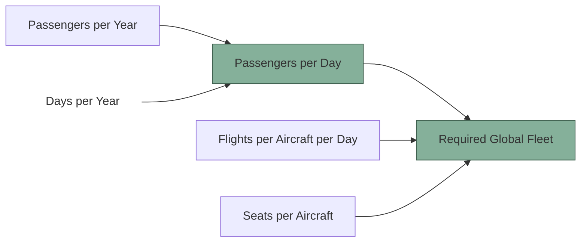

# Aviation

The "required global fleet" can be estimated using a very simple model that assumes the number of passengers flying globally annually is known, along with and estimation of the number of seats flown globally per day.

---

## Constants

| True Constant | Value | Unit         |
| ------------- | ----- | ------------ |
| days per year | $365$ | day year^-1^ |

| Inputs                       | Value           | Unit     | Source   |
| ---------------------------- | --------------- | -------- | -------- |
| passengers per year          | $5 \times 10^9$ | year^-1^ | ATAG[^1] |
| seats per aircraft           | $150$           | .        |          |
| flights per aircraft per day | $2$             | day^-1^  |          |

## Equations

Given that the two sourced inputs that are time dependent are given in different time bases, it is convenient to convert one of these so the two are consistent, as done in equation $\ref{equation:passengers-per-day}$.

$$
\begin{equation}
    \text{passengers per day} = \frac{\text{passengers per year}}{\text{days per year}}
    \label{equation:passengers-per-day}
\end{equation}
$$

The total required global fleet can then be calculated as a function of this intermediate value and the other inputs, as done in equation $\ref{equation:required-global-fleet}$.

$$
\begin{equation}
    \text{required global fleet} = \frac{\text{passengers per day}}{\text{seats per aircraft} \times \text{flights per aircraft per day}}
    \label{equation:required-global-fleet}
\end{equation}
$$

## Modeling Analysis

<iframe src="../assets/plot_passengers.html" width="100%" height="600px" style="border:none;"></iframe>

<iframe src="../assets/plot_fleet.html" width="100%" height="1000px" style="border:none;"></iframe>

[^1]: @atagFactsFigures
